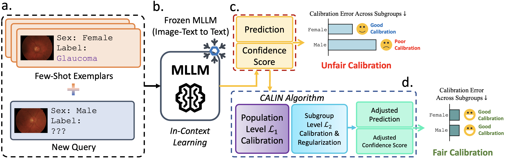

<h1 align="center">
Exposing and Mitigating Calibration Biases and Demographic Unfairness in MLLM In-Context Learning
</h1>

<p align="center">
  <a href="https://arxiv.org/abs/2506.23298"></a>
  <a href="https://www.python.org/"></a>
  <a href="https://pytorch.org/"></a>
  <a href="https://docs.vllm.ai/en/v0.9.1/"></a>
</p>

This repository contains the official implementation of the paper:
> __Exposing and Mitigating Calibration Biases and Demographic Unfairness in MLLM Few-Shot In-Context Learning for Medical Image Classification__  
> [Xing Shen](https://scholar.google.com/citations?hl=en&user=U69NqfQAAAAJ), [Justin Szeto](https://scholar.google.com/citations?user=niVJ08oAAAAJ&hl=en), [Mingyang Li](https://scholar.google.com/citations?user=t-yX74gAAAAJ&hl=en), [Hengguan Huang](https://scholar.google.com/citations?hl=en&user=GQm1eZEAAAAJ), [Tal Arbel](https://www.cim.mcgill.ca/~arbel/)  
> _International Conference on Medical Image Computing and Computer Assisted Intervention, 2025_  
> __Paper ([arXiv preprint](https://arxiv.org/abs/2506.23298))__

### Ethical and responsible use of health data with large language models
We are committed to promoting the ethical and responsible use of health data in the context of large language models (LLMs) and multimodal large language models (MLLMs). The code provided in this repository is intended solely for demonstration and research purposes. It must not be interpreted as permission to use any protected health information. We urge users to carefully consider the ethical dimensions of their work and to ensure full compliance with all applicable laws and regulations governing the use of health data.

## Overview
Multimodal large language models (MLLMs) offer strong potential for few-shot in-context learning in medical image analysis. However, their deployment in clinical settings demands careful evaluation of both prediction accuracy and calibration, especially across demographic subgroups. To address this need, we propose **CALIN**, an inference-time calibration method that mitigates calibration bias and demographic unfairness. CALIN estimates calibration matrices through a bi-level approach: first at the population level, then refined at the subgroup level, before adjusting confidence scores during inference. This ensures fairer and more reliable predictions across diverse populations.
<p align="center">
  
</p>

## 1. Preparation
### 1.1 Installation
It is recommended to use a virtual environment (e.g., `venv`) to avoid package conflicts. Here we assume you are using `venv` as your virtual environment. If you are using conda, please adjust the commands accordingly.
```bash
git clone https://github.com/xingbpshen/medical-calibration-fairness-mllm.git
cd medical-calibration-fairness-mllm/
pip install -r requirements.txt
```
### 1.2 Preparing the dataset
The downloaded dataset should be structured in the following format, the `data/` directory should be placed at the root of the repository:
```
   data/
    ├── dataset1/
    │   ├── images/
    │   │   ├── image1.jpg
    │   │   ├── image2.jpg
    │   │   └── ...
    │   └── splits/
    │       ├── train.csv
    │       └── test.csv
    ├── dataset2/
    │   └── ... 
    └── ...
```
The split files can have a few key columns such as: `image_name`, `patient_age`, `diagnosis`.
### 1.3 Downloading the open-source MLLM (optional)
The implementation in this code repository supports closed-source MLLM inference via API requests and also open-source MLLM inference via [vLLM](https://docs.vllm.ai/en/latest/). It is recommended to download the MLLM from [Hugging Face](https://huggingface.co) using the following command:
```bash
huggingface-cli login
huggingface-cli download {REPO_NAME} --local-dir {SAVE_FOLDER} --local-dir-use-symlinks False
```
Please modify the `{REPO_NAME}` and `{SAVE_FOLDER}` according to your needs.
### 1.4 Modifying configs
Please modify all config files in `config/` according to your experimental settings, and make sure you followed the instructions stated in config files.

## 2. Running inference
Please run the following command to run inference:
```bash
python main.py --config {DATASET}.yml --log {LOG_FOLDER_PATH} --trial {TRIAL_NAME} --service {SERVICE} --comment {COMMENT}
```
Replace `{DATASET}`, `{LOG_FOLDER_PATH}`, `{TRIAL_NAME}`, `{SERVICE}`, and `{COMMENT}` with your desired dataset, log folder path, trial name, service type, and comment respectively. The help message can be viewed by running `python main.py --help`.

The inference results file `log.json` will be saved in the specified path `{LOG_FOLDER_PATH}/{TRIAL_NAME}/`.

This inference script supports automatically resuming from the last checkpoint if the inference was interrupted. It will also automatically create the log folder if it does not exist.

## Acknowledgments
This work was supported in part by the Natural Sciences and Engineering Research Council of Canada (NSERC), in part by the Canadian Institute for Advanced Research (CIFAR) Artificial Intelligence Chairs Program, in part by the Mila - Quebec Artificial Intelligence Institute, in part by the Mila-Google Research Grant, and in part by the Canada First Research Excellence Fund, awarded to the Healthy Brains, Healthy Lives initiative at McGill University.

## Contact
Please raise a GitHub issue or email us at <a href="mailto:xing.shen@mail.mcgill.com">xing.shen@mail.mcgill.com</a> (with the email subject starting with "[CALIN]") if you have any question or encounter any issue.
